# via

[](https://github.com/p-to-q/via/actions/workflows/ci.yml)
[](LICENSE)

See the paths before you build.

via helps your coding agent reason through the options, then maps 3 potential engineering paths.<br>
Compare tokens, time, and route summaries at a glance.

```text
Read https://github.com/p-to-q/via/blob/main/skills/via-route/SKILL.md and follow the instructions to install and configure via.
```



Three routes. Real overlap. Local branches. Distinct starts or outcomes when the task calls for them. Token and time ranges.

At its simplest, via works with a familiar model behavior: after reasoning about an open planning question, models often present three comparable ways forward. That format is broadly legible to users. via keeps the explanations, recommendation, and useful feedback, then adds a picture as another way to understand the same decision. Three remains a natural interface default, never a reason to invent a weak option.

via keeps the prompt light. It nudges the model to think carefully, understand the user's real intent, and work from the task itself, then leaves the model room to follow its own intuition and native reasoning behavior. RouteSpec constrains the added visual—not the model's thinking interface or written answer—and the bundled scripts handle validation and SVG rendering.

The product has three reference families. Modern AI-native coding interfaces are one of them: Claude informs on-demand visual artifacts and SVGs. ChatGPT and Codex inform the surrounding UI, coding context, and VI details. Inside via's own interface, Google Maps and Google Earth contribute spatial route comparison, while Git Tree contributes engineering topology.

via gives this interaction a small engineering fixture: the model puts its routes into RouteSpec and the renderer turns them into the SVG. The schema reduces uncertainty about how to organize the technical structure while the routes, nodes, topology, and recommendation still come from the model's judgment.

Our hypothesis is that this light schema can also help the model think more clearly. Expressing technical work as nodes, dependencies, shared segments, branches, and outcomes may encourage a more principled topology during reasoning. It remains a nudge, not a required reasoning procedure.

via is designed for the same moment as Plan mode. It gathers the context that matters, asks only consequential questions, and lets the model reason at the depth the task needs before implementation. The difference is the interface: the normal plan and feedback remain, with a route map added beside them. via is an alternative to a text-only planning surface, not a replacement for a host's permissions, reasoning controls, or thinking UI.

## Model fit

via works best with capable tool-using coding or reasoning models. A practical threshold is a model-agent setup that can inspect a repository, form three materially distinct routes from an ambiguous engineering task, and emit valid RouteSpec with at most one small repair. Smaller models may spend more context following the Skill than they recover from its structure. If the model cannot form distinct routes or reliably produce RouteSpec, use a normal text response instead. See [Model fit and evaluation](docs/model-fit.md).

## Install

via requires Node.js 20 or newer and has no runtime dependencies.

### Skill entrypoint

via is loaded through [`skills/via-route/SKILL.md`](skills/via-route/SKILL.md). That file is the Skill entrypoint: it tells the agent when to use via and links to the RouteSpec contract, JSON Schema, evaluator, and renderer scripts.

To install and configure via inside another coding agent, paste this prompt into that agent:

```text
Read https://github.com/p-to-q/via/blob/main/skills/via-route/SKILL.md and follow the instructions to install and configure via.
```

For Codex, you can also install the Skill from this GitHub repository with the Skill installer:

```text
$skill-installer install p-to-q/via skills/via-route
```

The installer places the Skill under `$CODEX_HOME/skills` and makes it available on the next turn.

You can also clone the repository and symlink the Skill manually:

```bash
git clone https://github.com/p-to-q/via.git
mkdir -p ~/.agents/skills
ln -s "$(cd via && pwd)/skills/via-route" ~/.agents/skills/via-route
```

### Wake it up

In a chat box, type `/via` to wake via explicitly:

```text
/via plan three ways to migrate this auth flow
```

In Codex Skill contexts, you can also name the installed Skill directly:

```text
$via-route plan three ways to migrate this auth flow
```

Advanced agents can also trigger via from natural language when the request is clearly route-style planning:

- "show me three routes for this implementation"
- "make a token map for this task"
- "compare architecture options before we build"
- "plan the migration paths and show the tradeoffs"
- "/via for this decision"

### Codex Plugin bundle

The repository contains a validated `.codex-plugin/plugin.json` for plugin packaging and marketplace submission. The first public release is installed as a Skill or CLI; it is not yet published in a Codex marketplace.

### CLI

Install the CLI from npm:

```bash
npm install --global @afkv/via
```

The source repository remains [`p-to-q/via`](https://github.com/p-to-q/via). The npm package is published from the maintainer scope while the `@p-to-q` npm organization is being prepared.

Or install directly from GitHub:

```bash
npm install --global github:p-to-q/via
```

Check the installed version:

```bash
via -v
```

Build any RouteSpec:

```bash
via build route.json --out via-output
```

Validate without rendering:

```bash
via validate route.json
```

The output documents itself:

```text
via-output/
├── route.svg
├── route.json
└── route.md
```

## Try the example

```bash
git clone https://github.com/p-to-q/via.git
cd via
npm install
npm run build:example
```

Open `example-output/route.svg`.

## How it works

The source is one directed graph:

- nodes are engineering checkpoints;
- edges carry one or more route IDs;
- shared edges create overlap;
- branch edges create local detours;
- routes may share all, some, or none of their path;
- routes normally share a start and finish, but may declare different origins or outcomes when that is true of the task;
- `START` and `DONE` are fixed endpoint roles attached to their graph nodes, while their captions are generated from the actual origin and achieved state.

The Skill creates the RouteSpec, validates it, renders it, and shows the SVG with the model's normal planning response. It skips tiny work and tasks without three credible paths.

This separation is deliberate: the model decides what the task means, explains the useful paths, and gives its recommendation and feedback; the schema organizes what the additional visual should show; the renderer turns that representation into the interface. via does not ask the model to follow a second reasoning system or compress its useful analysis into the graph.

via also stays out of the host's thinking UI. If ChatGPT, Codex, Claude, or another agent shows progress or a reasoning summary while it works, that remains available according to the host's own behavior and policy. via governs the added route map, not whether the host exposes a thinking panel or how it labels one.

via has no persistent mode for the user to manage. It appears when the current turn contains a real route decision. After a route is chosen, the model continues normally from that context. The map is redrawn only when the goal, constraints, evidence, or available paths materially change; once the task becomes straightforward execution, via naturally falls away.

See the [RouteSpec contract](skills/via-route/references/route-spec.md), [example graph](examples/web-coder-route.json), [product architecture](docs/product-architecture.md), [interface system](docs/design-system.md), [model fit notes](docs/model-fit.md), and [agent surface notes](docs/agent-surfaces.md).

## What via does not claim

- Token ranges compare incremental model workload; time ranges compare active agent time to the next useful engineering deliverable. Both are estimates, not telemetry.
- via avoids unnecessary prompt and formatting overhead, but it does not shorten useful route explanations merely to save tokens.
- Three routes are useful only when three materially different paths exist.
- A structurally valid map does not make its recommendation automatically correct.
- via is not a mandatory planning workflow. If the map does not save reading time, skip it.

## Research and evaluation

The bundled [Skill landscape](docs/skill-landscape.md) records the community research behind the design. The repository's [evaluation set](https://github.com/p-to-q/via/tree/main/evals) covers trigger precision, fake-route cases, topology, proof checkpoints, scan speed, and conversation continuation.

## Development

```bash
npm install
npm run check
```

See [CONTRIBUTING.md](CONTRIBUTING.md), [SUPPORT.md](SUPPORT.md), [SECURITY.md](SECURITY.md), [CHANGELOG.md](CHANGELOG.md), and the [0.3.9 release notes](docs/releases/v0.3.9.md).

Apache-2.0 © [p → q] contributors.
